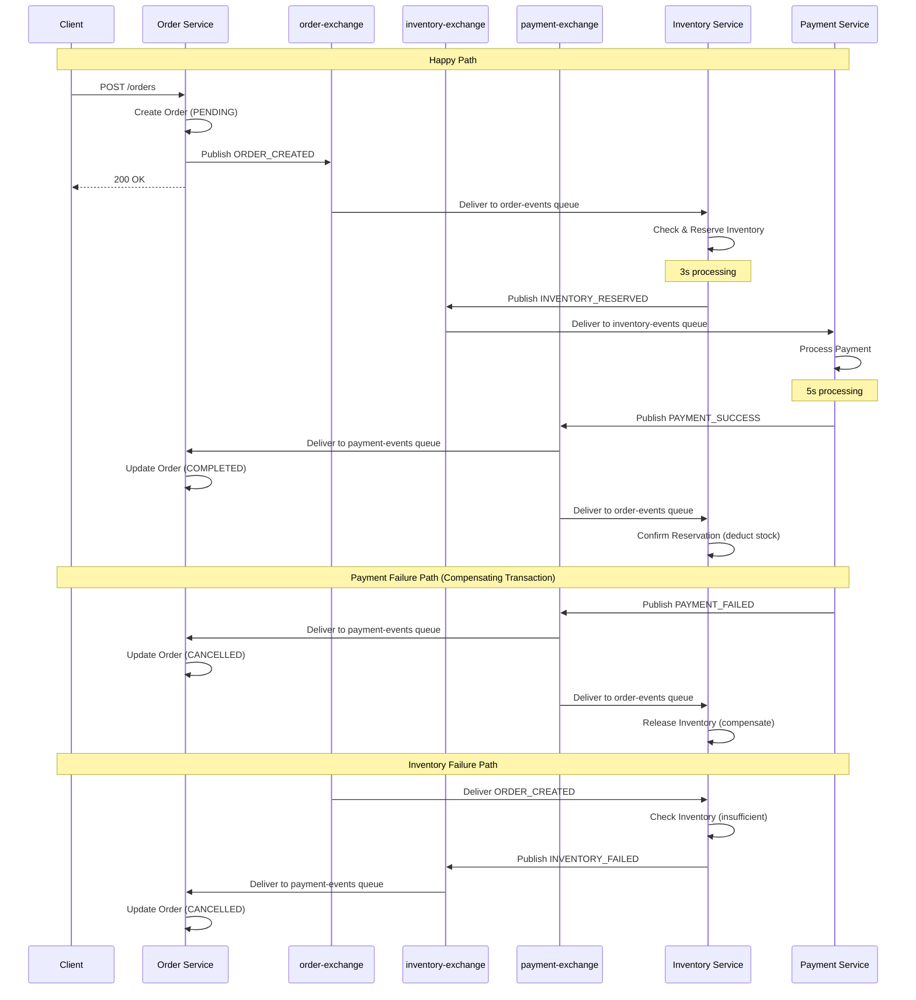

# SWAP

Software Architecture Project 2026 - University of Helsinki

## Architecture

Event-driven microservices architecture using **RabbitMQ** for choreography-based saga pattern.

### Choreography vs Orchestration

This system implements **choreography** where:

- No central coordinator - each service autonomously decides when to act
- Services react to events and publish new events based on their domain logic
- Saga flow emerges from service interactions rather than being explicitly directed
- Each service knows its responsibility and reacts independently

This differs from **orchestration** where a central service would direct each step of the transaction.

**Trade-off:** The workflow is implicit (no single place to see the full flow) but services are fully decoupled and can evolve independently.

### Services

- **Order Service** - Manages order lifecycle and maintains order state
- **Inventory Service** - Manages inventory reservations and releases
- **Payment Service** - Processes payments and persists transaction records

### RabbitMQ Architecture

This system uses **RabbitMQ topic exchanges** for true pub/sub choreography:

**Exchanges:**

- `order-exchange` - Order-related events
- `inventory-exchange` - Inventory-related events
- `payment-exchange` - Payment-related events

**Queues & Bindings:**

| Queue              | Constant                  | Bound Exchanges                          | Events Received                                         | Consumer          |
| ------------------ | ------------------------- | ---------------------------------------- | ------------------------------------------------------- | ----------------- |
| `order-events`     | `QUEUES.ORDER_EVENTS`     | `order-exchange`, `payment-exchange`     | `ORDER_CREATED`, `PAYMENT_SUCCESS`, `PAYMENT_FAILED`    | Inventory Service |
| `inventory-events` | `QUEUES.INVENTORY_EVENTS` | `inventory-exchange`                     | `INVENTORY_RESERVED`                                    | Payment Service   |
| `payment-events`   | `QUEUES.PAYMENT_EVENTS`   | `payment-exchange`, `inventory-exchange` | `PAYMENT_SUCCESS`, `PAYMENT_FAILED`, `INVENTORY_FAILED` | Order Service     |

**How Exchanges Enable Choreography:**

- Services publish events to **exchanges** (not directly to queues)
- Each service creates its own queue and **binds** it to exchanges it cares about
- Publishers don't know who consumes their events (true decoupling)
- New consumers can be added by simply binding new queues to existing exchanges
- No dual publishing needed - one publish reaches all interested subscribers

**Example Flow:**

1. Payment Service publishes `PAYMENT_SUCCESS` to `payment-exchange`
2. Both Order Service and Inventory Service receive it (their queues are bound to that exchange)
3. Payment Service doesn't know or care who listens - pure choreography

## Flow



## Testing

This project has automated testing made with Bun, which are run automatically in Pull Requests, or manually by `bun run test`. If you want to test manually, I recommend testing via the UI as it gives the best overview of the system.

### Happy path

Happy path (=successful) is the scenario when everything goes fine: user creates an order, there's inventory and payment succeeds. See instructions in `services/order-service` how to run.

### Failure Scenarios

#### Payment Failure (with compensating transaction)

To test payment behavior, pass `paymentBehaviour` in the order creation request:

```bash
curl -X POST http://localhost:3001/orders \
  -H "Content-Type: application/json" \
  -H "x-session-id: your-session-id" \
  -d '{
    "items": [
      {
        "product": "laptop",
        "quantity": 1
      }
    ],
    "paymentBehaviour": "failure"
  }'
```

**Behaviour Options:**

- `"success"` - Operation succeeds (default if omitted)
- `"failure"` - Operation intentionally fails for testing
- `"random"` - 50% chance to succeed or fail

You can set both `paymentBehaviour` and `inventoryBehaviour` independently to test different failure scenarios.

When payment fails:

1. Order is created normally in PENDING status
2. Inventory is reserved successfully
3. Payment intentionally fails with "Transaction intentionally failed for testing purposes"
4. Order status is updated to CANCELLED
5. Inventory reservation is released (compensating transaction)

#### Inventory Failure

To test the inventory failure path, you can either:

1. **Force failure with behaviour flag:**

```bash
curl -X POST http://localhost:3001/orders \
  -H "Content-Type: application/json" \
  -H "x-session-id: your-session-id" \
  -d '{
    "items": [{"product": "laptop", "quantity": 1}],
    "inventoryBehaviour": "failure"
  }'
```

2. **Order non-existent product:**

```bash
curl -X POST http://localhost:3001/orders \
  -H "Content-Type: application/json" \
  -H "x-session-id: your-session-id" \
  -d '{"items": [{"product": "non-existent", "quantity": 1}]}'
```

3. **Order excessive quantity:**

```bash
curl -X POST http://localhost:3001/orders \
  -H "Content-Type: application/json" \
  -H "x-session-id: your-session-id" \
  -d '{"items": [{"product": "laptop", "quantity": 999}]}'
```

When inventory check fails:

1. Order is created in PENDING status
2. Inventory check fails (product not found, insufficient stock, or forced failure)
3. INVENTORY_FAILED event is published
4. Order status is updated to CANCELLED
5. No payment is attempted

### Seed Inventory

Before testing, seed the inventory with initial stock:

```bash
curl -X POST -H "x-session-id: your-session-id" http://localhost:3002/inventory/seed
```

## Running

### Setup

- Copy `.env.example` to `.env` files in root, frontend and all service folders
- See individual service folders for install and development run instructions.
- Or just run `docker compose up` after setting up environment values.

#### GKE Deployment

Remember to setup environment secrets to GitHub Actions secrets (take example from manifests/.env.example)

```bash
# Note: replace project id and cluster details as needed

# Create GKE Cluster
gcloud container clusters create swap-cluster --zone=europe-north1-b --disk-size=16 --num-nodes=3 --machine-type=e2-medium

# Enable Gateway API (required for Ingress)
gcloud container clusters update swap-cluster --location=europe-north1-b --gateway-api=standard

# Grant roles
gcloud projects add-iam-policy-binding dwk-gke-484423 --member="serviceAccount:github-actions@dwk-gke-484423.iam.gserviceaccount.com" --role="roles/container.developer"
gcloud projects add-iam-policy-binding dwk-gke-484423 --member="serviceAccount:github-actions@dwk-gke-484423.iam.gserviceaccount.com" --role="roles/storage.admin"
gcloud projects add-iam-policy-binding dwk-gke-484423 --member="serviceAccount:github-actions@dwk-gke-484423.iam.gserviceaccount.com" --role="roles/artifactregistry.writer"

# Create key file
gcloud iam service-accounts keys create gcp-key.json --iam-account=github-actions@dwk-gke-484423.iam.gserviceaccount.com

# Copy to clipboard (PowerShell)
Get-Content gcp-key.json | Set-Clipboard


# HTTPS setup
# Create static IP for Ingress
gcloud compute addresses create swap-static-ip --global

# Get the IP address (use this in DNS setup)
gcloud compute addresses describe swap-static-ip --global --format="get(address)"
```

## Session Isolation

We use **session-based data isolation** to support multiple concurrent users in public demos without data conflicts.

### How It Works

- Each user gets a unique session ID (UUID) stored in browser localStorage
- All database tables include a `session_id` column with composite primary keys
- All API requests include `x-session-id` header
- Session ID flows through the entire saga workflow via events
- Users only see their own orders, inventory, and payments

### Frontend Features

**Session Display & Regeneration:**

- Session ID shown in the UI
- Click the refresh button to generate a new session
- Sessions seeded automatically

### Implementation Details

**Database Schema:**

- Composite primary keys: `(id, session_id)` on products, orders, payments, reservations
- Indexed on `session_id` for query performance!
- Migration-safe: existing data gets `session_id = 'default'`

**Backend Changes:**

- All storage functions accept `sessionId` parameter
- All queries filter by `session_id`
- Event handlers extract and propagate `sessionId`
- API routes validate `x-session-id` header presence

## Notes

- Types are shared via `@swap/shared` package
- Monorepo structure for ease of development
- All services use idempotency keys for message deduplication
- Mock delays simulate real-world processing times
- New sessions start with fresh data for isolated testing
