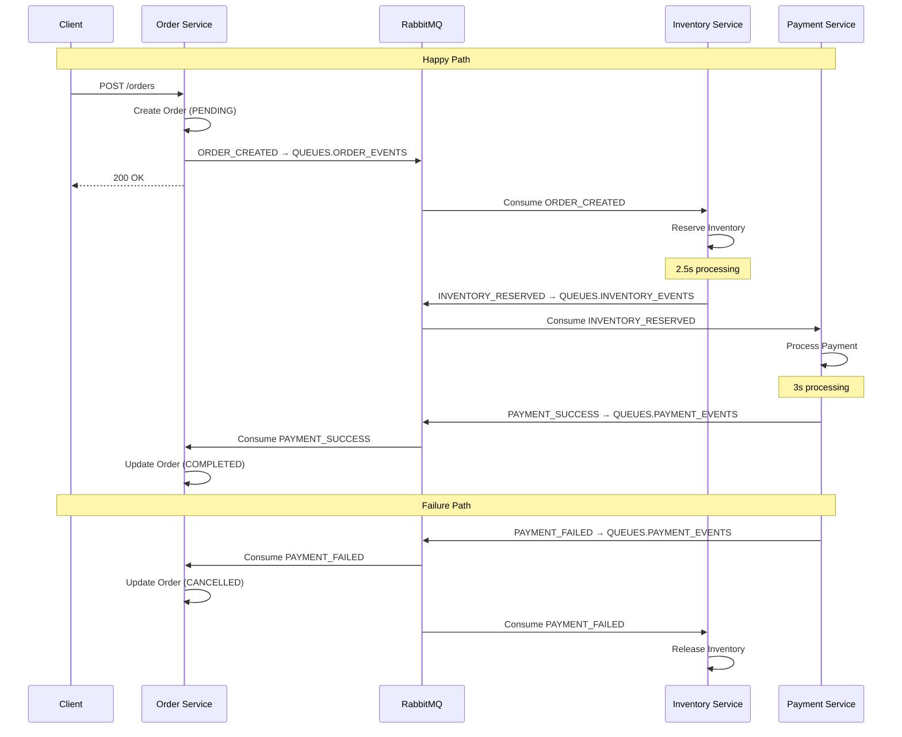

# SWAP

Software Architecture Project 2026 - University of Helsinki

## Architecture

Event-driven microservices architecture using **RabbitMQ** as the message broker.

### Services

- **Order Service** - Orchestrates order lifecycle and maintains order state
- **Inventory Service** - Manages inventory reservations and releases
- **Payment Service** - Processes payments and handles transactions

### RabbitMQ Queues

| Queue              | Constant                  | Events                                                                |
| ------------------ | ------------------------- | --------------------------------------------------------------------- |
| `order-events`     | `QUEUES.ORDER_EVENTS`     | `OrderEventType.ORDER_CREATED`                                        |
| `inventory-events` | `QUEUES.INVENTORY_EVENTS` | `InventoryEventType.INVENTORY_RESERVED`                               |
| `payment-events`   | `QUEUES.PAYMENT_EVENTS`   | `PaymentEventType.PAYMENT_SUCCESS`, `PaymentEventType.PAYMENT_FAILED` |

## Flow



## Testing

This project has automated testing made with Bun, which are run automatically in Pull Requests, or manually by `bun run test`

### Happy path

Happy path (=successful) path is the scenario when everything goes fine: user creates an order, there's inventory and payment succeeds. See instructions in `services/order-service` how to run.

### Failure Scenarios

To test the cancellation flow, pass `failTransaction: true` in the order creation request:

```json
{
  "items": [
    {
      "product": "Widget",
      "quantity": 2
    }
  ],
  "failTransaction": true
}
```

When this flag is set:

1. Order is created normally in PENDING status
2. Inventory is reserved successfully
3. Payment intentionally fails with "Transaction intentionally failed for testing purposes"
4. Order status is updated to CANCELLED
5. Inventory reservation is released

## Running

See individual service folders for instructions.

## Notes

- Types are shared via `@swap/shared` package
- Monorepo structure for ease of development
- All services use idempotency keys for message deduplication
