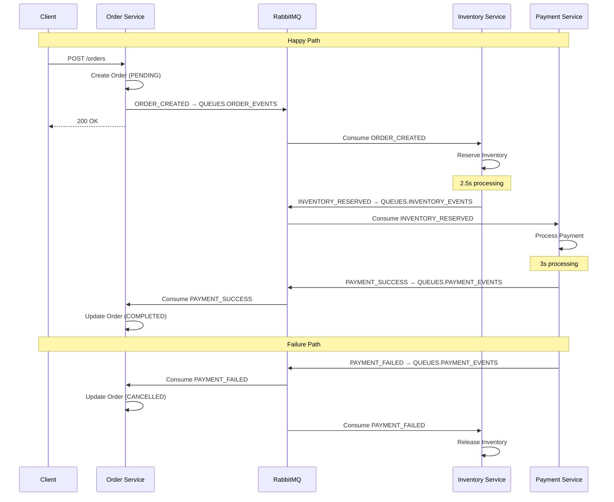

# SWAP

Software Architecture Project 2026 - University of Helsinki

## Architecture

Event-driven microservices architecture using **RabbitMQ** as the message broker.

### Services

- **Order Service** - Orchestrates order lifecycle and maintains order state
- **Inventory Service** - Manages inventory reservations and releases
- **Payment Service** - Processes payments and handles transactions

### RabbitMQ Queues

| Queue              | Constant                  | Events                                                                |
| ------------------ | ------------------------- | --------------------------------------------------------------------- |
| `order-events`     | `QUEUES.ORDER_EVENTS`     | `OrderEventType.ORDER_CREATED`                                        |
| `inventory-events` | `QUEUES.INVENTORY_EVENTS` | `InventoryEventType.INVENTORY_RESERVED`                               |
| `payment-events`   | `QUEUES.PAYMENT_EVENTS`   | `PaymentEventType.PAYMENT_SUCCESS`, `PaymentEventType.PAYMENT_FAILED` |

## Flow

## Running

See individual service folders for instructions.

## Notes

- Types are shared via `@swap/shared` package
- Monorepo structure for ease of development
- All services use idempotency keys for message deduplication
